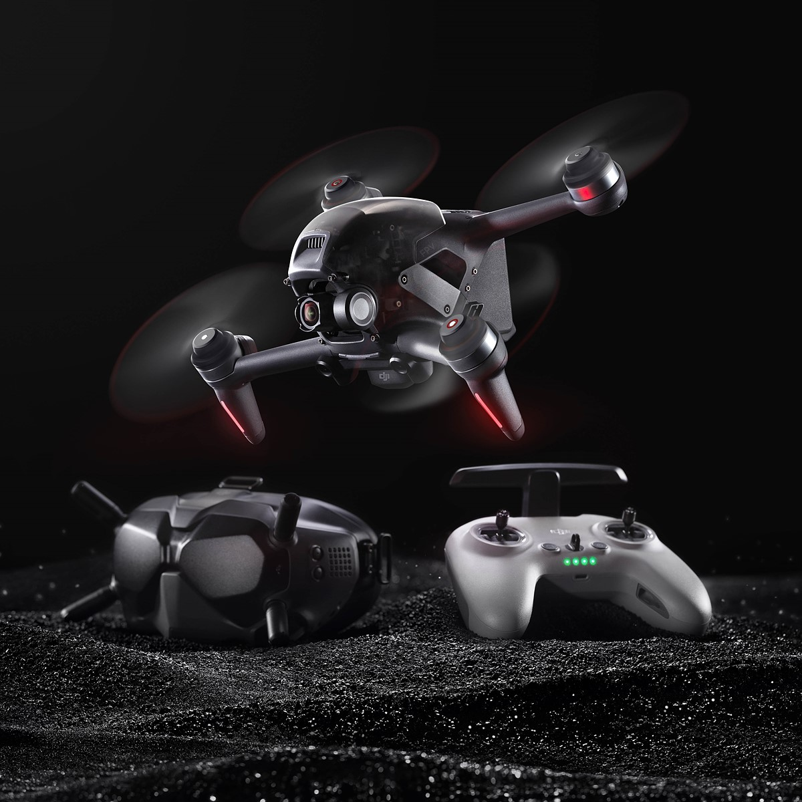

<h1 align = "center">🤖💻 Computer Engineer 🤖💻</h1>

- 💻 Computer Engineer and Drone Operator specializing in Artificial Intelligence 
- 👋 This profile was created to collaborate on projects and create professional networking 
- 🤖 Always working to evolve 
- 🚁 Drone (UAV) operator 

<h2 align = "center">Programming Language & Frameworks</h2>

  
   
  
  
  
   
  
  
  
  
  

<h2 align = "center" border = "">Tools</h2>

  
  
  
  
  
  
  

<h2 align = "center">IT</h2>

  
  
  
  

<h2 align = "center">Hardware</h2>

  
  
  
  
  

<strong>Note:</strong> 
<em>The programming languages, tools, and hardware specified is not linear. More at 
<a align = "center">https://armando-adorno.github.io/armando-adorno/</a>
</em>

